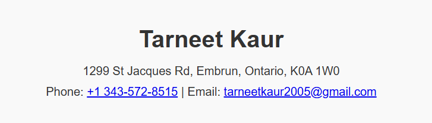
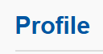
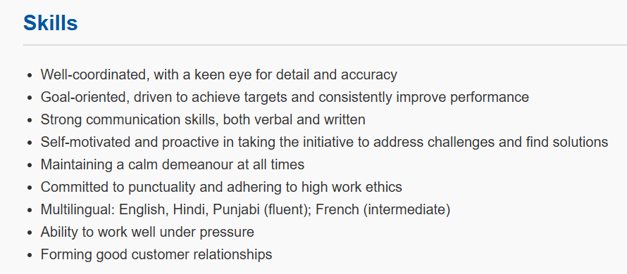
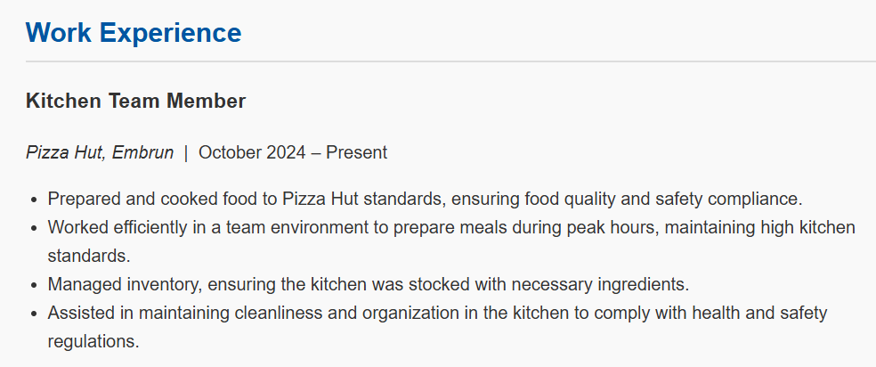
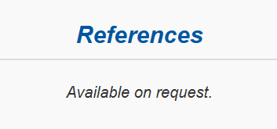
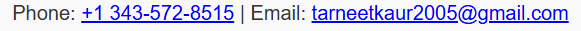

# Tarneet Kaur – Design System Documentation

This documentation provides a clear overview of the design system used for my resume web page. It includes **colors**, **typography**, **components**, **responsiveness**, and screenshots of mock-ups.

## **1. Color Palette**
- **Primary Accent Color:** `#0056a3` (used for section titles)
- **Text Color:** `#333` (default body text)
- **Background Color:** `#f9f9f9` (page background)
- **Border Color:** `#ddd` (underlines in section titles)

## **2. Typography**
- **Body Text:** `Arial, sans-serif`
- **Headers (H1, H2, H3):** Default sans-serif (styled with size + color differences)

## **3. Components and Layout**

### Header
- **Design:** Centered name with contact information below. Phone number is a `tel:` link, email is a `mailto:` link.  
- **Mock-up Screenshot:**  

### Section Titles
- **Design:** Blue heading text (`#0056a3`) with a light gray underline (`#ddd`).  
- **Mock-up Screenshot:**  

### Skills List
- **Design:** Unordered list (`<ul>`) with clear spacing and padding for readability. Each bullet point describes a different skill.  
- **Mock-up Screenshot:**  

### Experience Section
- **Design:** Each job is wrapped in an `<article>`. Contains a job title (`<h3>`), company name with dates (`
<em>...</em>
`), and a bulleted list of responsibilities.  
- **Mock-up Screenshot:**  

### Footer
- **Design:** Centered text with italic style, used for References section.  
- **Mock-up Screenshot:**  

### Links
- **Design:** Both phone and email in the header are interactive links.  
   - **Phone link:** `tel:+13435728515`  
   - **Email link:** `mailto:tarneetkaur2005@gmail.com`  
- **Mock-up Screenshot:**  

## **4. Responsiveness**
- Page is constrained to **max-width: 800px** for readability.  
- Margins and padding ensure content stays centered on different screen sizes.  
- Lists and text flow naturally on smaller devices.  

## **Conclusion**
This design system summarizes the colors, fonts, components, responsiveness, and links used in Tarneet Kaur’s resume project to ensure consistency and accessibility across future work.
