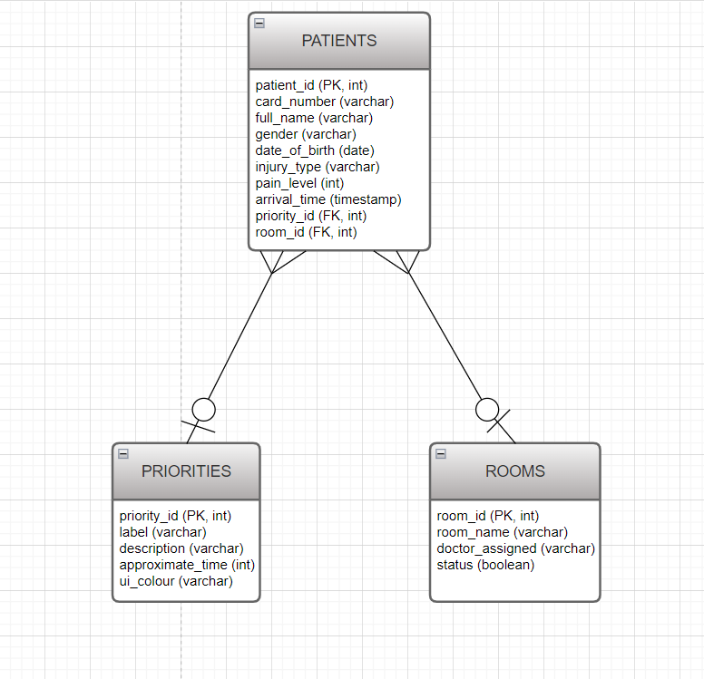

# Hospital Triage Database Design

## Entities Description

### Patients
The **Patients** entity stores information about each person who submits a triage entry in the Hospital Triage app.  
Each record represents one patient’s visit, including who they are, when they arrived, the type of injury, pain level, and the priority and room assigned by the admin.

### Priorities
The **Priorities** entity defines the different triage levels used in the app (for example: Low, Medium, High, Critical).  
It is used to standardize how urgent a patient’s condition is, and it also supports the colour-coded design and approximate response time shown in the interface.

### Rooms
The **Rooms** entity stores information about the rooms where patients can be treated.  
It indicates which doctor is responsible for the room and whether the room is currently available or occupied.

---

## Attributes Specification

### Patients Attributes

- `patient_id` (**INT**, PRIMARY KEY, NOT NULL)  
  Unique identifier for each patient triage entry.

- `card_number` (**VARCHAR**, NULL)  
  Optional medical card or hospital ID number.

- `full_name` (**VARCHAR**, NOT NULL)  
  Patient’s full name.

- `gender` (**VARCHAR**, NULL)  
  Recorded gender for the patient.

- `date_of_birth` (**DATE**, NULL)  
  Patient’s date of birth.

- `injury_type` (**VARCHAR**, NOT NULL)  
  Type of injury selected on the User page  
  (for example: “Head”, “Heart”, “Lung”, “Neck”, “Stomach”, “Bone or Muscle”, “Burn or Cut”).

- `pain_level` (**INT**, NOT NULL)  
  Pain level chosen by the user, typically a value from 1 to 10.

- `arrival_time` (**TIMESTAMP**, NOT NULL)  
  Date and time when the patient arrived or submitted their triage entry.

- `priority_id` (**INT**, FOREIGN KEY, NOT NULL)  
  References `Priorities.priority_id`.  
  Indicates the triage level (Low / Medium / High / Critical) that the admin assigns.

- `room_id` (**INT**, FOREIGN KEY, NULL)  
  References `Rooms.room_id`.  
  Identifies the room to which the patient is assigned.  
  This value can be NULL if the patient has not yet been assigned a room.

---

### Priorities Attributes

- `priority_id` (**INT**, PRIMARY KEY, NOT NULL)  
  Unique identifier for the priority level.

- `label` (**VARCHAR**, NOT NULL)  
  Short name for the level, such as “Low”, “Medium”, “High”, or “Critical”.

- `description` (**VARCHAR**, NULL)  
  Longer explanation of what this priority level means.

- `approximate_time` (**INT**, NULL)  
  Estimated waiting time in minutes associated with this level.

- `ui_colour` (**VARCHAR**, NULL)  
  Hex colour code used in the UI for this priority level  
  (for example: `#74C69D` for Low, `#F9C74F` for Medium, etc., matching the Lab 10 colour palette).

---

### Rooms Attributes

- `room_id` (**INT**, PRIMARY KEY, NOT NULL)  
  Unique identifier for each room.

- `room_name` (**VARCHAR**, NOT NULL)  
  Human-readable room name or number (for example “ER-01”).

- `doctor_assigned` (**VARCHAR**, NULL)  
  Name of the doctor responsible for this room.

- `status` (**BOOLEAN**, NOT NULL)  
  Indicates whether the room is currently occupied.  
  `TRUE` = occupied, `FALSE` = available.

---

## Relationships

- Each **Patient** is assigned **one Priority**.  
  (`Patients.priority_id` → `Priorities.priority_id`, many-to-one relationship)

- Each **Patient** may be assigned **one Room**.  
  (`Patients.room_id` → `Rooms.room_id`, many-to-one relationship)

- One **Priority** can be linked to many Patients.  
- One **Room** can hold many Patients over time.

---

## Database ERD (Entity-Relationship Diagram)

The ERD illustrates these three entities and the foreign key relationships from **Patients** to **Priorities** and **Rooms**.  
Primary keys are marked on each table, and foreign keys in the `Patients` table show how triage entries connect to priority levels and room assignments.
